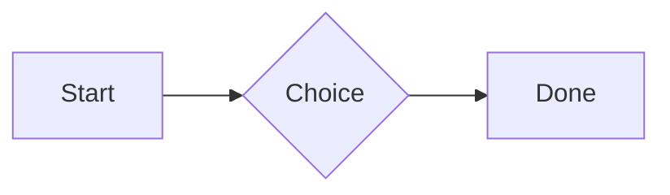

# Welcome

This is the **fixture vault** for the Vault app's checks. It has *italic*, ==highlighted==, ~~struck~~ and `inline code` text, a [[Projects/Project Alpha|project link]], a link to [[Ideas#Big ideas]], a block link [[Ideas#^idea-one]] and an [[Unwritten note]] that doesn't exist yet. Tags: #start and #nested/tag.

A [Markdown link](Ideas.md) and an external one: [Obsidian](https://obsidian.md).

## Tasks

- [ ] Write the first note
- [x] Open the vault
- [ ] Nested parent
    - [ ] Nested child ^task-child
- Plain bullet
1. Numbered one
2. Numbered two

## Callouts

> [!note] A note callout
> With some **content** and a [[Ideas|link]].

> [!warning]- Folded warning
> Hidden until opened.

> [!tip] Tip with no body

> A plain quote.

## Table

| Name | Value | Notes |
| ---- | ----: | :---: |
| One  | 1     | first |
| Two  | 2     | [[Ideas]] |

## Code and maths

```js
function hello(name) {
  return `Hello, ${name}`;
}
```

Inline maths $e^{i\pi} + 1 = 0$ and a block:

$$
\int_0^1 x^2 \, dx = \frac{1}{3}
$$



## Embeds

![[Ideas#Big ideas]]

![[pixel.png|64]]

Footnote reference[^1] and an inline one.^[Inline footnote text.]

%% A hidden comment with #not-a-tag and [[Not a link]] %%

---

Last line with a block id. ^last-block

[^1]: The footnote definition.
